# LasRuasso
## SEBASTIAN OSORIO ARANGO EJ1:
### LINK: https://youtu.be/sGpyI7Oa4bU
## DANIEL RUA MONTAÑO:
### LINK: https://youtu.be/_qDSPCZdeBg
## EJERCICIO 2:
### Link: https://youtu.be/Gem0Z_4kgXc
### TimeLine:
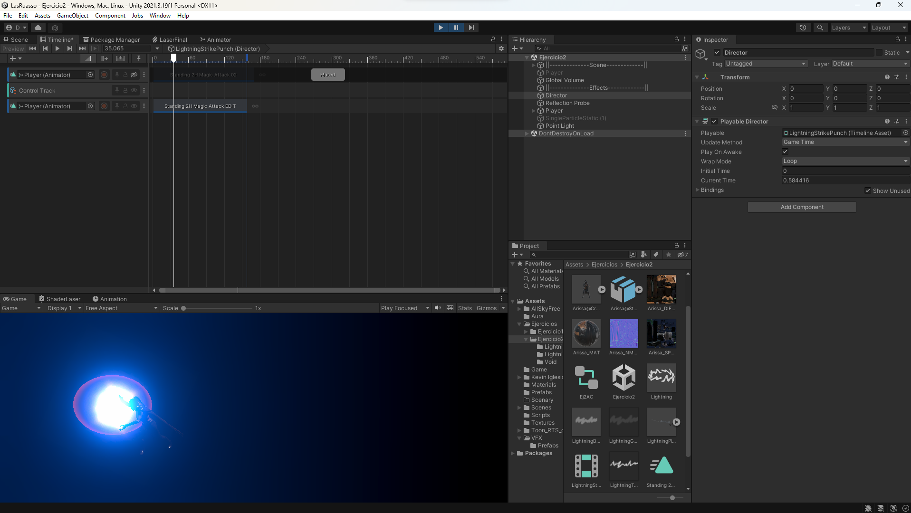
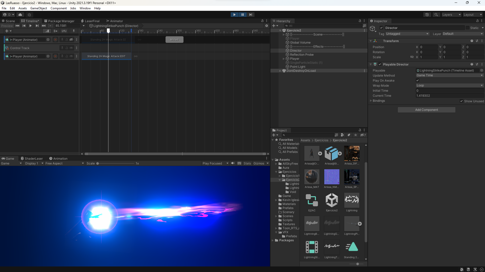

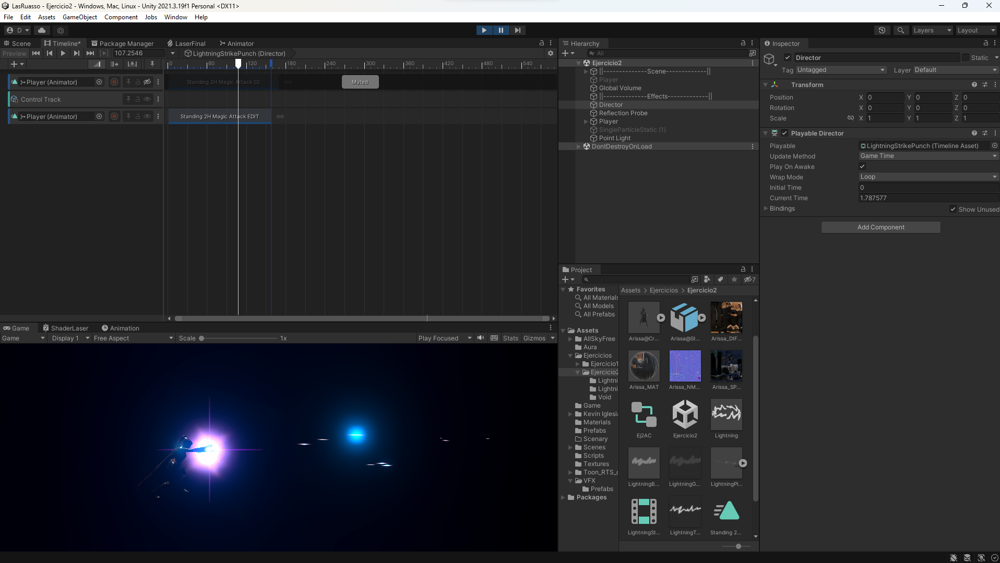
### Jerarquia:
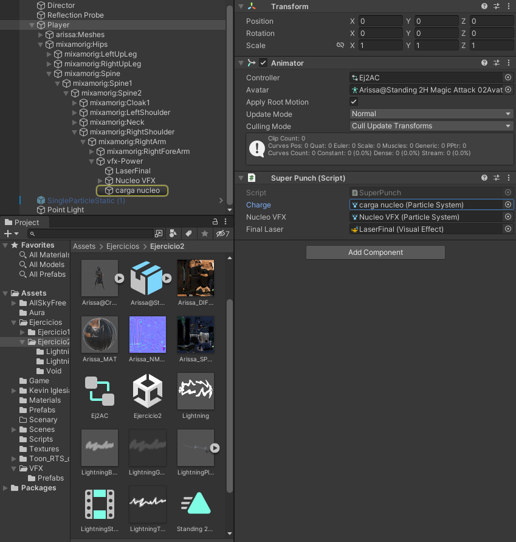
### Referencias en escala de grises:
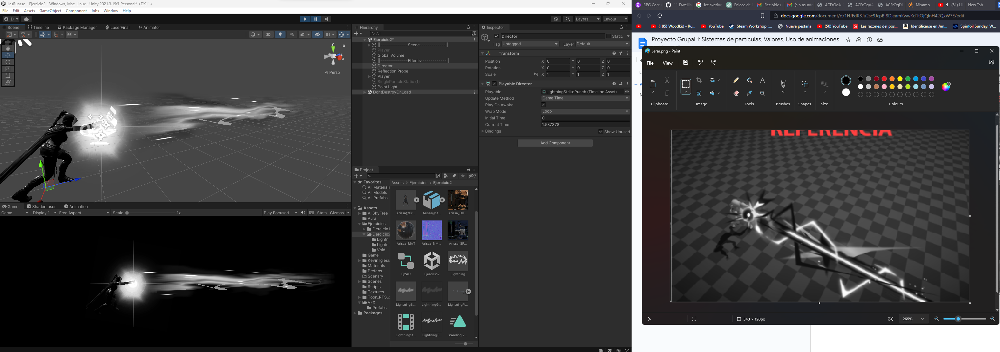
### Mas Referencias:
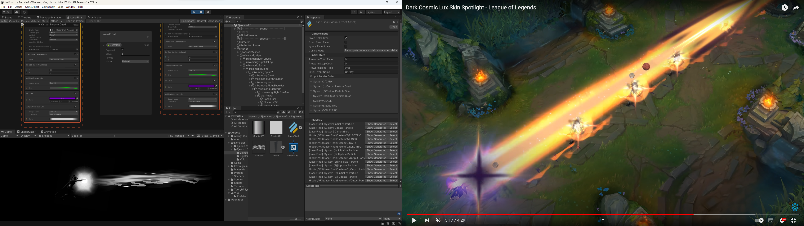
### Valores:
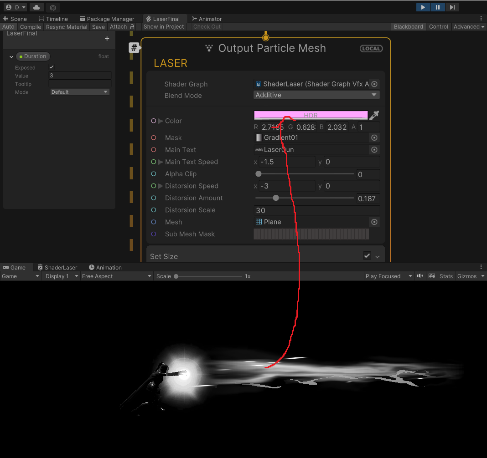
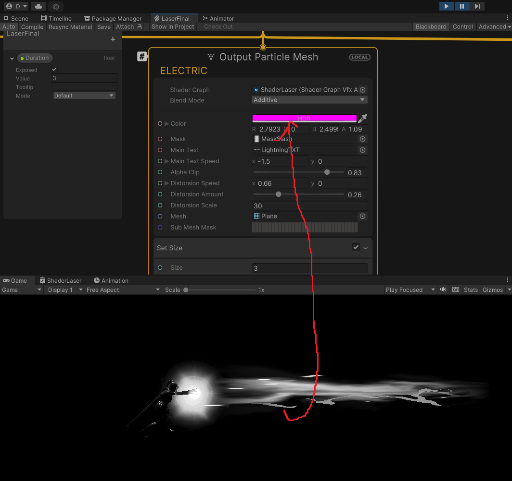
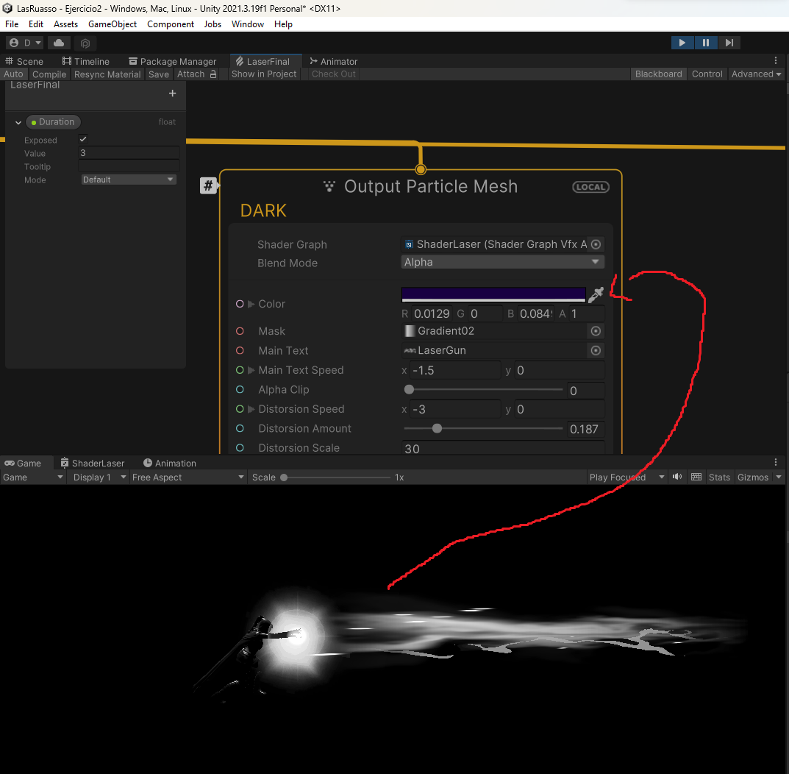
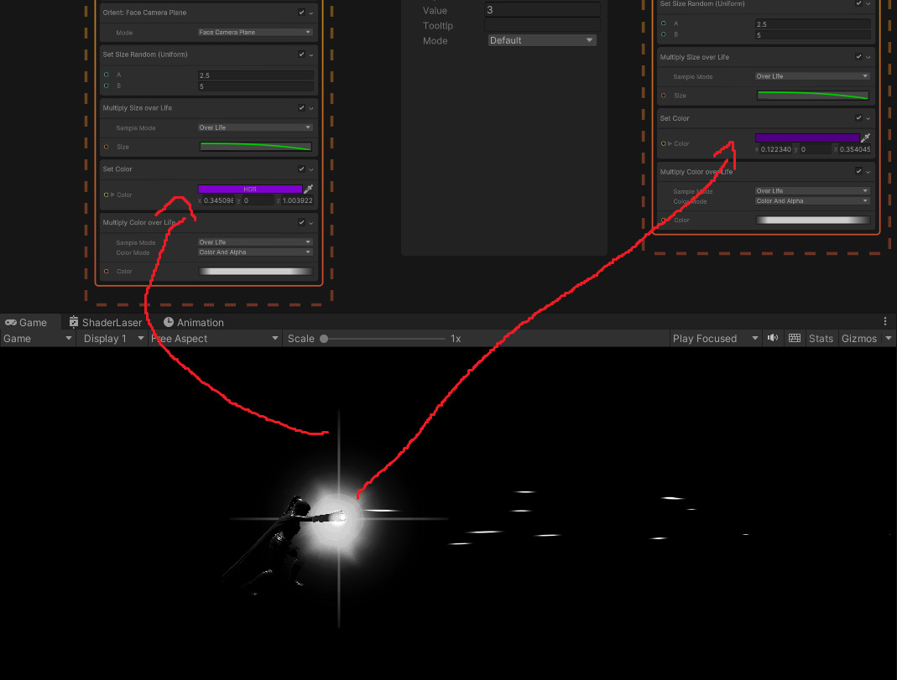

# Shaders
## SEBASTIAN OSORIO ARANGO (DISTORSION):
### REFRACTION:
### SHADER:
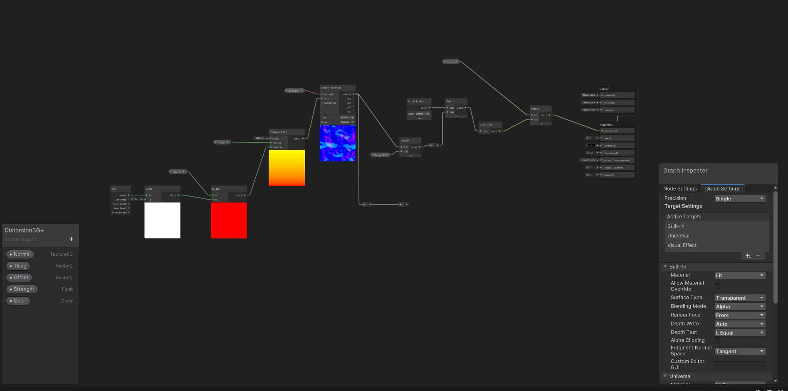
### VIDEO: https://youtu.be/JWPzb9KqE0U
### SMOKE:
### SHADER:
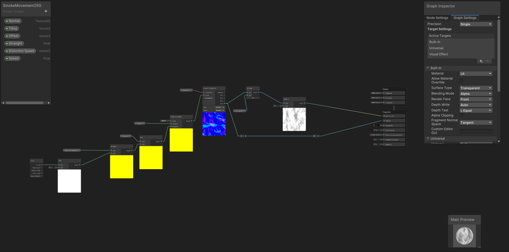
### VIDEO: https://youtu.be/t12YQZckBi8
### DISSOLVE SMOOTH:
### SHADER:
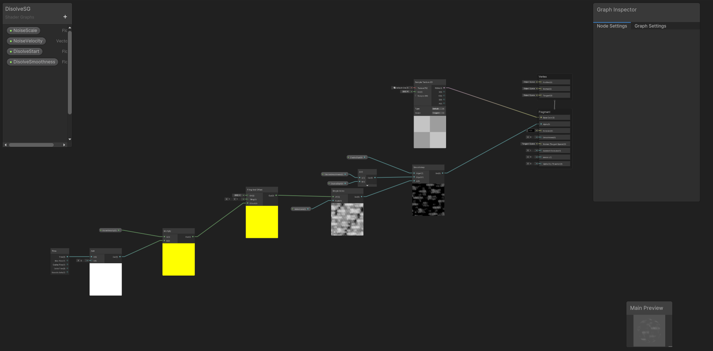
### VIDEO: https://youtu.be/XjoK3UeXSV8
### DISSOLVE TEXTURE:
### SHADER:
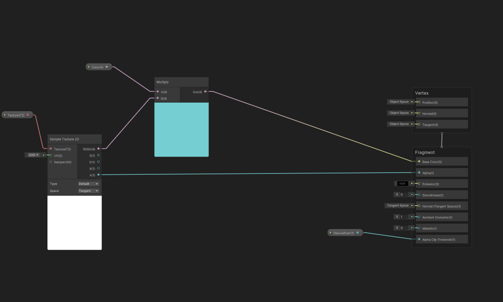
### VIDEO: https://youtu.be/m9xC4ZWp8Q8
## DANIEL RUA MONTAÑO (MASK):
### MULTICHANNEL MASK

### VIDEO:

